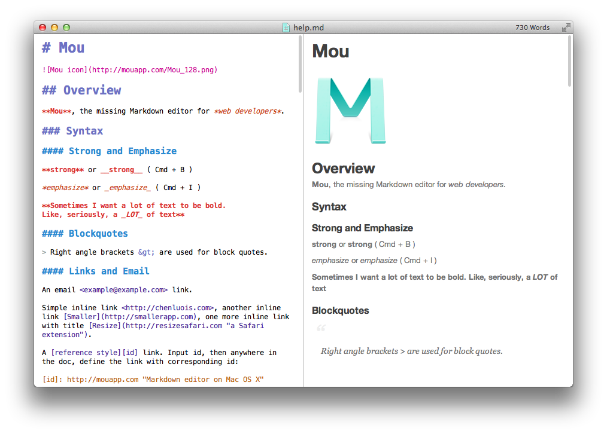

## What is this Blog?

Hi! This Gatsby blog is where you can learn about how I am working on the various projects on my GitHub account, and the skills I am learning and developing.

This blog will also be its own project, and since I'm starting with the basic blog starter from Gatsby, I'll be able to add plenty of functionality in due time—if it makes sense.

## Why Gatsby.js for a blog?

Gatsby is a great option here, because it uses React.js, and skill with this framework is in high demand.

I also prefer using Markdown to write as opposed to another CMS such as Wordpress.

[(photo credit)](https://miro.medium.com/max/1400/0*lzRmzAy5OICef7rK.png)

I have already deployed several websites to Netlify, and that's perfect for me, as I'll be able to start this site without picking or paying for a domain name.

## Why blog at all?

I'll be posting something every day, for the next three months (if I miss a day, then I'll double up on another day).

I have a few goals I'm trying to accomplish with this blog:

1. **Transition to be a developer** Now that I'm in the dissertation-writing phase of my PhD program, it's time to start paying the bills.

2. **Build a portfolio** In order to transition to be a developer, I will need a github portfolio with some basic and more advanced projects. Building my portfolio will help me refine my coding skills, and will be a great point of contact when I'm applying for jobs.

3. **Build blogging skills** A track record of successful blogging is likely as valuable in the job search as a solid portfolio. But it's actually far more valuable than just getting a job. A blog is a way to build an audience, and there's no limit to the value that brings (both for the blogger and for the audience!).

Specifically, I'm going to work on the following skills (I'm sure I'll update this list at some point):

- React.js
- Ruby on Rails
- JavaScript
- Gatsby.js
- Markdown blogging
- Basic server administration (something I've already done far more of with my marketing business than I expected to!)
- Machine learning with Python (I'm mostly a 'consumer' when it comes to ML, but I've made lots of use of GenSim)

## Some inspirational thoughts to return to

Here's some inspirational quotes [(source)](https://dev.to/jeremycmorgan/7-great-programming-quotes-o95) about programming that I'll be putting to the test with this blog.

>"Programming isn't about what you know; it's about what you can figure out.” _- Chris Pine_

If this is true, Chris Pine, then I'll make an excellent developer, because doing PhD research is very similar: you not only have to figure out the solution to your problem, the answer to your question, but you also have to come up with the question in the first place based on the inadequacies or gaps in other people's solutions.

>"The only way to learn a new programming language is by writing programs in it.” _- Dennis Ritchie_

I'm going to put this learning method into practice.

## What do you get out of this blog?

This blog tells you how a PhD student in the humanities can get a job as a developer.

I'm coming at this task with some basic Python experience (I write scripts using machine learning and natural language processing libraries for my research). I've used Git/Bitbucket a fair bit (only through the command line). And I've deployed a couple of Gatsby sites using templates (more on that some other time). 

If you want to change career paths and become a developer—perhaps you're just a PhD student like me who needs to pay the bills—then this blog will show you a path that worked.

Right now it's impossible to subscribe to this blog in any way, but I'll add that functionality soon. For now you can simply email me at **ryder at ryderwishart dot com**.
